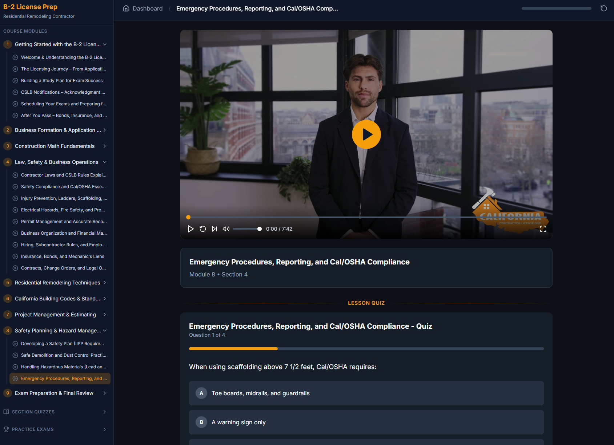

# B-2 Contractor License Exam Prep LMS


A modern, Thinkific-style Learning Management System for California B-2 Residential Remodeling Contractor License exam preparation. Built with Next.js 14, React 18, TypeScript, and Tailwind CSS.

## ✨ Features

### 📚 Comprehensive Course Content
- **63 Video Lessons** across 9 modules covering all exam topics
- **414 Quiz Questions** mapped to individual lessons
- **12 Practice Exams** (6 Law & Business + 6 Trade)

### 🎯 Per-Video Quizzes
- Each lesson has a dedicated quiz displayed directly below the video
- Questions are topic-matched to lesson content
- Instant feedback with correct/incorrect indicators
- Pass/fail scoring with 70% threshold

### 📊 Progress Tracking
- Automatic video progress saving
- Lesson completion tracking
- Quiz and exam score history
- Overall course progress percentage
- All data persisted in localStorage

### 🎨 Modern UI/UX
- Professional slate and amber color palette
- Smooth Framer Motion animations
- Responsive sidebar navigation
- Mobile-friendly design
- Dark mode optimized

## 🛠 Tech Stack

- **Framework**: Next.js 14 (App Router)
- **Language**: TypeScript
- **Styling**: Tailwind CSS
- **Animations**: Framer Motion
- **Icons**: Lucide React
- **State**: React Hooks + localStorage

## Setup

### 1. Install Dependencies

```bash
cd lms
npm install
```

### 2. Link Video Files

**Option A: Symbolic Link (Recommended)**

Run PowerShell as Administrator:
```powershell
.\setup-videos.ps1
```

**Option B: Copy Videos**

Copy your video files to `public/videos/`

### 3. Generate Course Manifest (Optional)

If you add new videos, regenerate the manifest:
```bash
npm run generate-manifest
```

### 4. Start Development Server

```bash
npm run dev
```

Open [http://localhost:3000](http://localhost:3000)

## Project Structure

```
lms/
├── public/
│   └── videos/          # Video files (symlinked or copied)
├── scripts/
│   └── generate-manifest.js  # Auto-generate lessons.json
├── src/
│   ├── app/
│   │   ├── globals.css  # Global styles
│   │   ├── layout.tsx   # Root layout
│   │   └── page.tsx     # Main dashboard
│   ├── components/
│   │   ├── Dashboard.tsx
│   │   ├── ProgressBar.tsx
│   │   ├── QuizEngine.tsx
│   │   ├── Sidebar.tsx
│   │   └── VideoPlayer.tsx
│   ├── data/
│   │   ├── lessons.json # Course structure
│   │   └── quizzes.json # Quiz questions
│   ├── hooks/
│   │   └── useProgress.ts
│   ├── lib/
│   │   └── courseData.ts
│   └── types/
│       └── index.ts
└── package.json
```

## Color Palette

- **Slate**: Primary dark tones (backgrounds, cards)
- **Amber**: Accent color (buttons, highlights, progress)
- **Green**: Success states (completed, passed)
- **Red**: Error states (failed)

## Progress Persistence

All progress is stored in localStorage under `contractor-lms-progress`:
- Completed lessons
- Video watch progress
- Quiz scores
- Exam scores

## Adding Quiz Questions

Edit `src/data/quizzes.json` to add more questions. Format:

```json
{
  "id": "q1",
  "question": "Your question here?",
  "options": ["Option A", "Option B", "Option C", "Option D"],
  "correctAnswer": 0,
  "explanation": "Why this is correct..."
}
```

## 📖 Course Modules

| Module | Topic | Lessons |
|--------|-------|---------|
| 1 | Getting Started with the B-2 License | 6 |
| 2 | Business Formation & Application Process | 5 |
| 3 | Construction Math Fundamentals | 7 |
| 4 | Law, Safety & Business Operations | 9 |
| 5 | Residential Remodeling Techniques | 14 |
| 6 | California Building Codes & Standards | 5 |
| 7 | Project Management & Estimating | 7 |
| 8 | Safety Planning & Hazard Management | 4 |
| 9 | Exam Preparation & Final Review | 6 |

## 📸 Screenshots



## 🤝 Contributing

This is a private project. Contact the owner for access.

## 📄 License

Private - For authorized use only.
